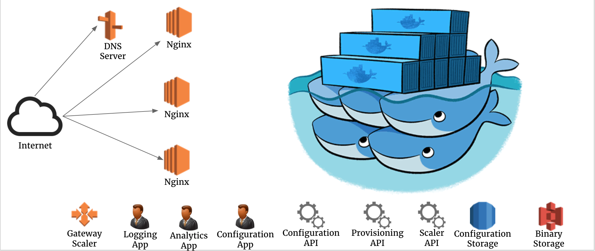

The platform for planning, deploying and releasing new innovators ideas.



# Technology stack

* Docker Swarm Mode
* Python 3
* Flask Micro Framework
* HTML5 / JS / CSS
* Web components
* Ansible 2

# Specs

* [Deployment](deployment/README.md)
* [OAuth2](docs/specs/security/oauth2.md)
* [Projects editor](docs/specs/projects-editor.md)
* [Storage](docs/specs/storage.md)
* [Service discovery](docs/specs/service-discovery.md)
* [Swarm orchestrator](docs/specs/swarm-orchestrator.md)

# Getting started

In order to start the platform follow the steps below:

1. Add the following lines to /etc/hosts.

    ```
    127.0.0.1       configuration-api.api.bravehub-dev.com
    127.0.0.1       configuration-app.api.bravehub-dev.com
    127.0.0.1       scenegraph-api.api.bravehub-dev.com
    ```

1. Start platform.

    ```bash
    sh deployment/provisioning/build-images.sh # you can safely ignore the errors.
    docker-compose build
    docker-compose up
    ```

1. Open http://configuration-app.api.bravehub-dev.com

This will start the platform and all APIs will be hot reloaded once you change the code.

## Best practices

### Python linting

```bash
sh cicd/lint-code.sh <project-name>
```

For instance, you might want to lint configuration api project.

```bash
sh cicd/lint-code.sh configuration-api
```

### Python unit testing

```bash
sh cicd/run-unit-tests.sh <project-name>
```

For instance, you might want to run the unit tests for the configuration api project.

```bash
sh cicd/run-unit-tests.sh configuration-api
```

### CPP linting

```bash
sh cicd/lint-code.sh load-balancer
```

## Generate APIs documentation

```bash
npm install -d
sh cicd/generate-api-specs.sh
open dist/apis
```

## Supported IDEs

* [Visual Studio Code](docs/ide/visualstudio-code.md)
