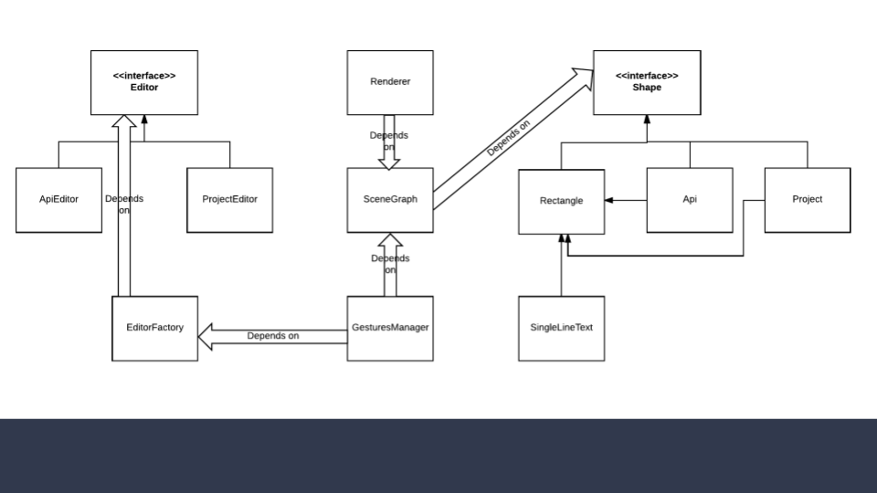

In this document we describe how the projects visual editor is implemented and how it can be extended.

One of the key differentiator of bravehub in comparison with other platforms (Heroku / AWS / GCP) is the simplicity of planning and deploying projects and their APIs.

In bravehub, we tackled a canvas approach where the user visually represents his infrastructure and obtains relevant insights (analytics / logs / errors).

# Technical summary

The visual editor is custom made and aims to obtain 60 fps rendering speed. A high level overview is presented in the next diagrams:

