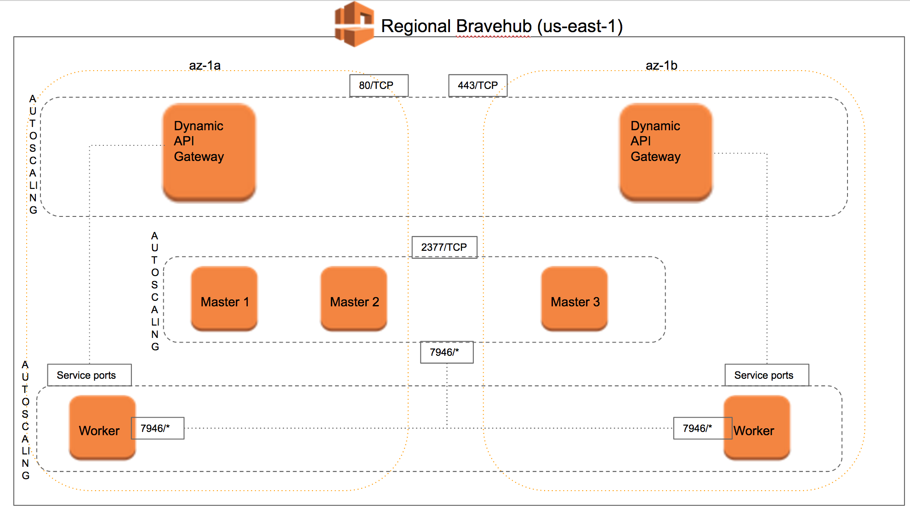

In this document we describe the deployment strategy we have used for the swarm orchestrator.

# Technical summary

At the moment, there is no segmentation between workers so every workload can be executed on every worker.

In the future we are going to rely on placement constraints in order to optimize our infrastructure and make it more scalable.

## Assumptions

* Every master node will be a reserved instance in order to reliably keep a stable quorum.
* Every worker can be either a spot instance (speculative) or reserved instance.
    - Worker nodes instances will have the same type.
    - In the future, the instance type will be the same for instances belonging to the same placement group.
* We run portainer (https://portainer.io/) as a debug tool. It runs on the first swarm master on port 9000.
    - In case of platform incidents we will be able to use this together with the detailed metrics collected.
* Swarm cluster is never exposed to the outside world. In order to manually connect to it you should connect through bastion.
